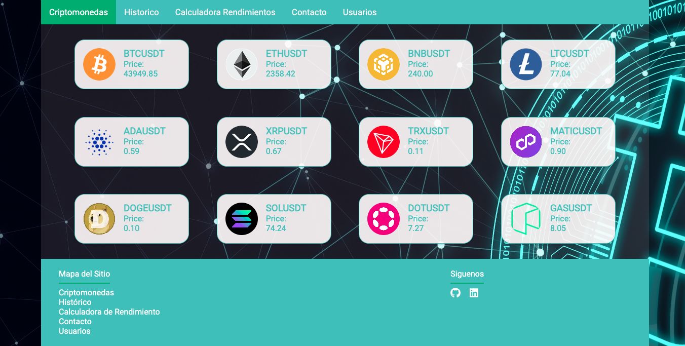
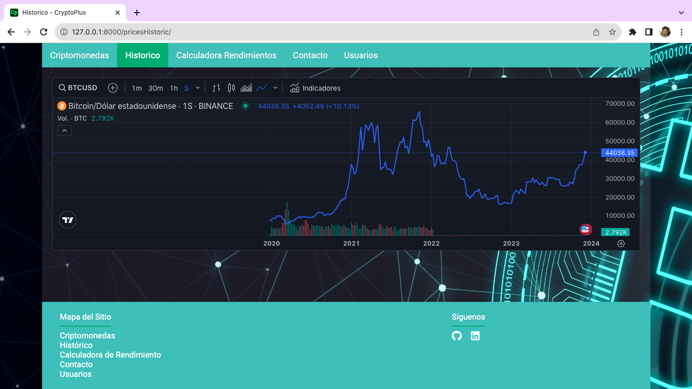
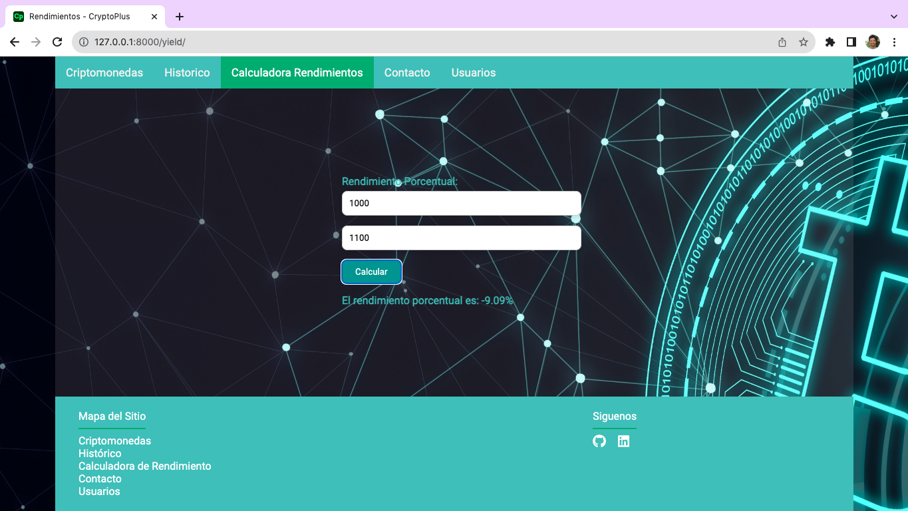
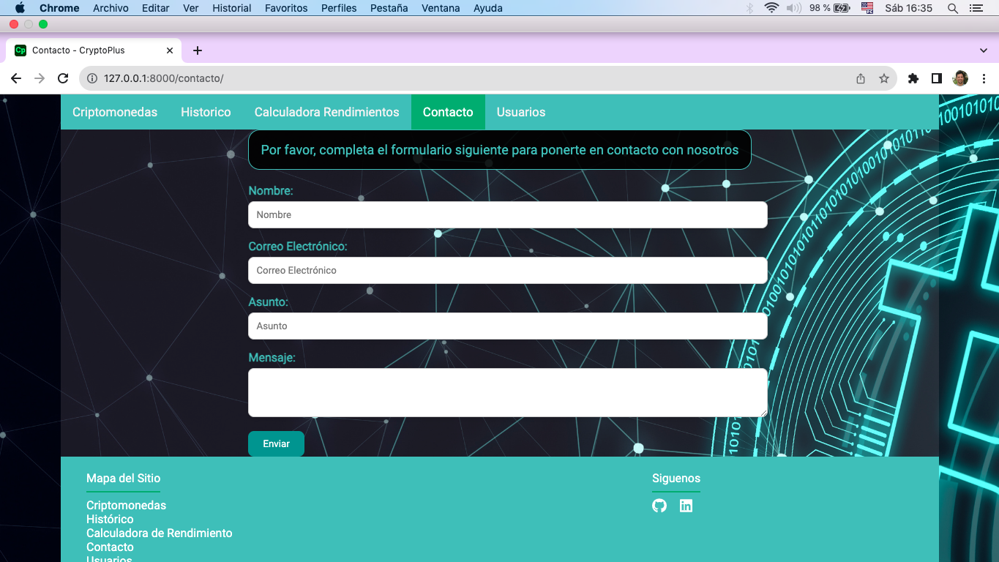
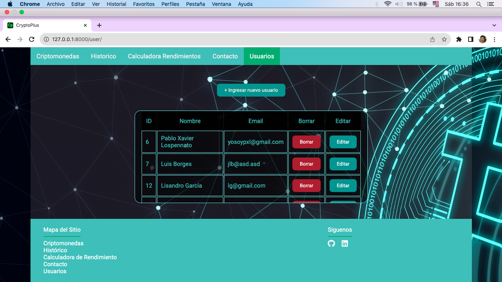
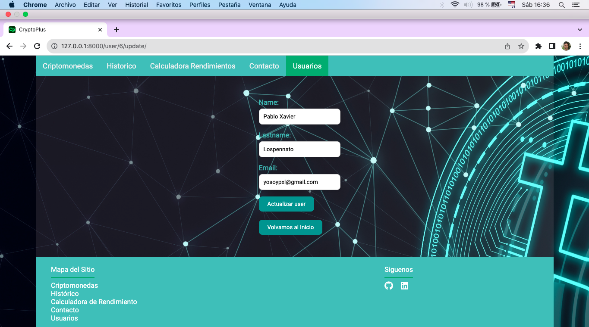
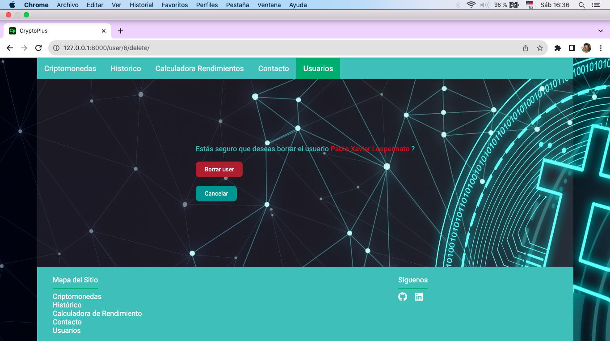

# Proyecto Django: CRYPTOPLUS
  
  

## Descripción

El proyecto CRYPTOPLUS es una aplicación web completa desarrollada en Django, que interactúa con la API de Binance para proporcionar información valiosa sobre las criptomonedas. Aparte de consumir y procesar datos criptográficos, también se gestiona un frontend propio y proporciona funcionalidades de administración y gestión de usuarios a través de Django.

Las principales funcionalidades de CryptoPlus incluyen:

- **Criptomonedas**: Visualización de las diferentes criptomonedas y su precio actual.
- **Histórico**: Funcionalidad para visualizar el gráfico de crecimiento de las criptomonedas.
- **Calculadora de Rendimiento**: Permite calcular el rendimiento de las inversiones en criptomonedas.
- **Contacto**: Sección que incluye un formulario de contacto para recibir mensajes.
- **Gestión de Usuarios**: A través de la pestaña Usuarios o del panel de administración de Django, CryptoPlus ofrece la capacidad de añadir, editar y eliminar usuarios de manera eficiente.


## Endpoints

Las siguientes son las rutas principales proporcionadas por la API. Cada endpoint está destinado a proporcionar las funcionalidades mencionadas.

```plaintext
/user/api-user/                 [GET, POST]
/user/api-user/{id}             [GET, PUT, DELETE]
```

## Desarrollo Local

1. Clonar el repositorio:

```bash
git clone https://github.com/pablolospe/django.git
```

2. Navegar al directorio del proyecto:

```bash
cd django_uno
```

3. Crear y activar un entorno virtual:

```bash
python -m venv .venv
source .venv/bin/activate  # Linux/macOS
.venv\Scripts\activate     # Windows
```

4. Instalar las dependencias:

```bash
pip install -r requirements.txt
```

5. Realizar las migraciones:

```bash
python manage.py makemigrations
python manage.py migrate
```

6. Establecer el entorno de trabajo como local:

```bash
export DEVELOPMENT=1
```

7. Ejecutar el servidor localmente:

```bash
python manage.py runserver
```

## Estructura de los archivos
```
django
├── README.md
├── .vscode
│   └── settings.json
└── django_uno
    ├── users
    │   ├── admin.py
    │   ├── apps.py
    │   ├── __init__.py
    │   ├── migrations
    │   │   ├── 0001_initial.py
    │   │   └── __init__.py
    │   ├── models.py
    │   ├── templates
    │   │   ├── user_create.html
    │   │   ├── user_delete.html
    │   │   ├── user_detail.html
    │   │   └── user.html
    │   ├── urls.py
    │   └── views.py
    ├── manage.py
    ├── static
    │   ├── css
    │   │   ├── button.style.css
    │   │   ├── footer.style.css
    │   │   ├── form.style.css
    │   │   ├── header.style.css
    │   │   ├── pricesHisstoric.style.css
    │   │   ├── yield.style.css
    │   │   └── styles.css
    │   ├── images
    │   │   ├── crypto-background.webp
    │   │   └── favicon.png
    │   └── js
    │       ├── actions.js
    │       ├── form.js
    │       ├── responsive.js
    │       └── yield.js
    ├── templates
    │   ├── base_vinoteca.html
    │   └── index.html
    └── CryptoPlus
        ├── asgi.py
        ├── __init__.py
        ├── settings.py
        ├── urls.py
        ├── views.py
        └── wsgi.py
```

# Frontend

## Características

### 1. Criptomonedas

En la solapa "Criptomonedas", los usuarios pueden explorar una lista de criptomonedas populares junto con su precio actual en tiempo real. Esta función permite a los inversores y entusiastas de las criptomonedas estar al tanto de las últimas tasas de cambio. Clickeando los íconos, animados a traves de la función hover, somos redireccionados a la página de cada criptomoneda.

### 2. Histórico

La solapa "Histórico" ofrece un análisis gráfico del crecimiento de las criptomonedas a lo largo del tiempo. Los usuarios pueden visualizar gráficos interactivos que muestran la evolución de los precios, lo que les permite tomar decisiones más informadas sobre sus inversiones.

### 3. Calculadora de Rendimiento

La "Calculadora de Rendimiento" es una herramienta poderosa que permite a los usuarios estimar el rendimiento de sus inversiones en criptomonedas. Puedes ingresar tus datos y obtener una proyección de tus potenciales ganancias o pérdidas.

### 4. Contacto

La solapa "Contacto" proporciona un formulario de contacto que permite a los usuarios ponerse en contacto con nosotros para hacer preguntas, dar retroalimentación o solicitar asistencia.

### 5. Usuarios

La sección "Usuarios" proporciona una interfaz eficaz para gestionar los datos de los usuarios de la aplicación. Al hacer clic en la pestaña "Usuarios", accederás a una tabla que muestra una lista completa de usuarios. Puedes desplazarte por la tabla para ver todos los usuarios.

Cada usuario en la lista tiene asociados dos botones de acción:

- **Modificar**: Te permite editar los detalles del usuario seleccionado.

- **Borrar**: Te proporciona una opción para eliminar el perfil del usuario.

Además, en la parte superior de la tabla, hay un botón "Crear" que puedes usar para agregar un nuevo usuario a la lista.

Esta configuración de CRUD (Crear, Leer, Actualizar, Eliminar) hace que la administración de los perfiles de los usuarios sea una tarea rápida y sencilla.

## Contribución

Si deseas contribuir a este proyecto, por favor sigue estos pasos:

1. Haz Fork del repositorio
2. Clona tu repositorio fork
3. Crea una rama para tu contribución (`git checkout -b feature/nueva-caracteristica`)
4. Realiza tus cambios y commitea (`git commit -m 'Añadida nueva característica'`)
5. Haz push a tu rama (`git push origin feature/nueva-caracteristica`)
6. Crea un pull request


Este proyecto es una valiosa herramienta para cualquiera interesado en el mercado de criptomonedas, ya sea un inversor experimentado o alguien que está comenzando. ¡Explora las características, realiza un seguimiento de tus inversiones y mantente en contacto con nosotros!

¡Gracias por usar nuestro servicio de criptomonedas!

# Django

## Funcionalidades de /admin

El panel de administración de Django, o /admin, es una herramienta poderosa que permite a los administradores de la aplicación gestionar los datos de la aplicación. Cuando creas una aplicación de Django, Django genera automáticamente un panel de administración para tu aplicación.

El panel de administración incluye funcionalidades para:

Crear, editar y eliminar objetos.
Ver el historial de cambios de los objetos.
Buscar objetos.
Filtrar objetos.
Exportar objetos a un archivo.
Para acceder al panel de administración, debes iniciar sesión con una cuenta de administrador. Las cuentas de administrador se crean automáticamente cuando creas una aplicación de Django.

## Personalizar /admin
Puedes personalizar el panel de administración para adaptarlo a tus necesidades. Por ejemplo, puedes:

Añadir o eliminar campos de los formularios de edición.
Cambiar los nombres de los campos.
Añadir o eliminar menús.
Para personalizar /admin, debes editar los archivos de plantillas de /admin.


## Despliegue en PythonAnywhere

Este proyecto ya ha sido desplegado en PythonAnywhere, que es una plataforma de alojamiento en la nube popular para aplicaciones web Python.

Puedes acceder a la aplicación en funcionamiento en [http://ligarcia7.pythonanywhere.com](http://ligarcia7.pythonanywhere.com). Aquí puedes interactuar con todas las funcionalidades en un entorno de producción. Además nos brinda los endpoints de la API.

```plaintext
https://ligarcia7.pythonanywhere.com/user/api-user/                 [GET, POST]
https://ligarcia7.pythonanywhere.com/user/api-user/{id}             [GET, PUT, DELETE]
```

El despliegue en PythonAnywhere asegura que la aplicación esté disponible 24/7, con un rendimiento fiable y rápido.

Fue usado "Manual Configuration" (Configuración manual) en PythonAnywhere para asegurar un control total sobre cómo se ejecuta la aplicación, y se realizó una serie de ajustes importantes para adaptar la configuración a un entorno de producción. Esto incluye la configuración de archivos estáticos para permitir a la aplicación servir sus propios archivos estáticos.

Para cualquier problemática relacionada con el despliegue en PythonAnywhere, no dudes en abrir un issue en este repositorio o contactarme directamente.

## Views








